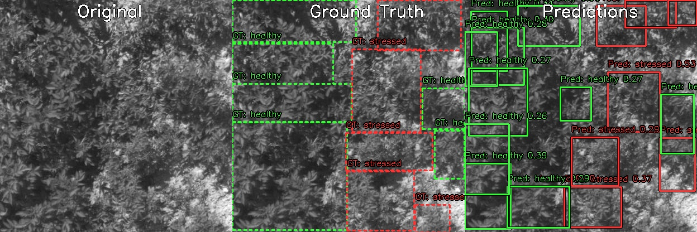

# Multispectral Example

This is an advanced example on customizing models and training without high level convenience libraries.

Let's use a multispectral [Dataset](https://www.webpages.uidaho.edu/vakanski/Multispectral_Images_Dataset.html)

```bash
cd multispectral
wget https://www.webpages.uidaho.edu/vakanski/Codes_Data/Spectral_Images.zip
unzip Spectral_Images.zip
rm Spectral_Images.zip
```

First we preprocess the dataset by creating aligned 4 channel tiffs from the individual channels.
For this we use [LightGlue](https://github.com/cvg/LightGlue), that is a neural network based feature matcher.

```bash
git clone https://github.com/cvg/LightGlue.git && cd LightGlue
python -m pip install -e .
```

Since the convenient ultralytics version of RT-DETR is not designed for multispectral input, let's use a orinal (PyTorch) implementation of rt-detr and modify it to work with our dataset.

```bash
git clone https://github.com/lyuwenyu/RT-DETR
```

Refer to `multispectral.py` for the full code.

Preprocess the dataset:

```bash
python multispectral.py --create-aligned
```

Visualize some training data:

```bash
python multispectral/multispectral.py --visualize-train --vis-samples 20

```

Train the model:

```bash
python multispectral/multispectral.py --train --epochs 100 --batch-size 4 --lr 5e-5 --patience 20
```

Test the model:

```bash
python multispectral/multispectral.py --test
```
## Conclusion

Looking at the results, we can see that the model is kindof working, but the dataset is small and labeling is poor quality in general, so it's a *Garbage in -> Garbage out* situation, but still good as a proof of concept.


